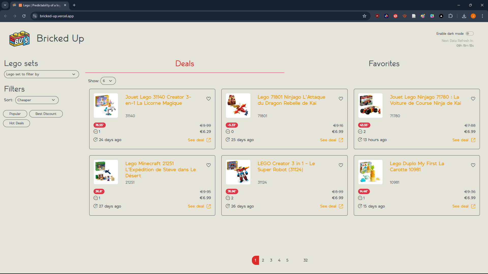
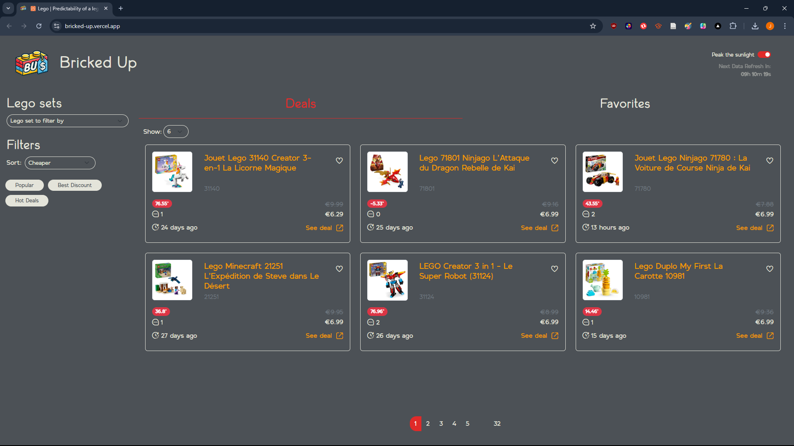
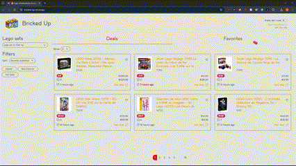
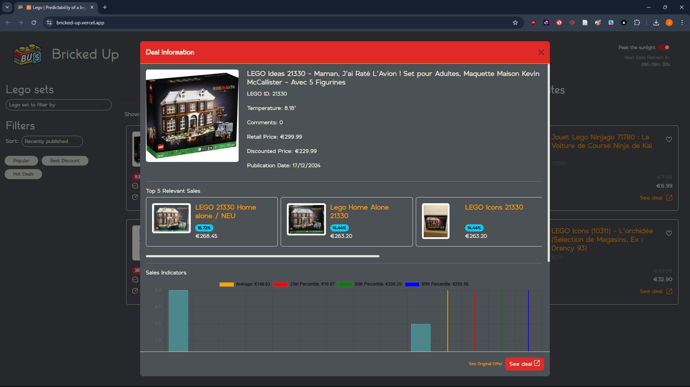

# 🧱 Bricked Up: Predictability of a LEGO Set Deal

## 🚀 Project Overview

**Bricked Up** is a full-stack web app that aggregates and analyzes **LEGO deals** 🧩 scraped from public sources. Users can browse deals, filter and sort listings, save favorites, and gain insights with interactive price indicators.

🌐 **Live Demo**: [**Visit Bricked Up**](https://bricked-up-lego.vercel.app)

---

## 💡 Why This Project?

**Bricked Up** solves the challenge of finding the best LEGO deals in a **user-friendly**, **responsive**, and automated way. By leveraging scraping, APIs, and automation, it ensures LEGO enthusiasts never miss out on a great deal. 🧱✨

---

## ✨ Features

-   🛒 **View Deals**: Browse through aggregated LEGO offers.
-   🔍 **Interactive Filters**:
    -   🏆 _Best Discount_
    -   🔥 _Hot Deals_
    -   📈 _Popular Deals_
-   📊 **Deal Insights**:
    -   Average and percentile price indicators.
    -   Expiration countdown for time-sensitive offers.
-   ❤️ **Save Favorites**: Mark and revisit your favorite deals.
-   🌗 **Dark Mode**: Toggle between light and dark themes.
-   🔄 **Automated Refresh**: Deals update **daily** at 5 AM and 6 PM UTC+2.
<!-- - 📱 **Responsive Design**: Works seamlessly on all devices. -->

---

## 🛠️ Technologies Used

-   **Frontend**: HTML, CSS (Bootstrap 5) 🎨, JavaScript ⚡
-   **Backend**: Node.js with Express.js 🚀
-   **Database**: MongoDB Atlas 🗄️
-   **Web Scraping**: Puppeteer 🕷️, Cheerio 🌿
-   **Deployment**: Vercel 🛠️
-   **Automation**: GitHub Actions 🕒

---

## 📸 Screenshots

  
_A clean, interactive homepage for LEGO enthusiasts._

  
\  
_Seamless switch to dark mode._

  
\  
_Key price insights with visual indicators._

---

## ⚙️ How It Works

1. **Data Collection**: 🕷️ Deals are scraped from public sources like **Dealabs** and **Vinted**.
2. **Backend API**: 📡 Data is stored in **MongoDB Atlas** and served through an Express.js API.
3. **Scheduled Updates**: ⏰ **GitHub Actions** refresh the data automatically twice a day.
4. **Client Rendering**: 🌟 The deals are displayed interactively with filtering, sorting, and responsive design.

---

## 🌐 Live Updates: Automation

The data refreshes **automatically**:  
⏰ **Daily at 5 AM and 6 PM UTC+2**  
Using **GitHub Actions** to ensure users always get the latest deals.

---

## 🗂️ Project Structure

```
bricked-up/
├── client/
│   └── v2/
│       ├── index.html       # Main client HTML file
│       ├── styles.css       # Custom CSS styles
│       ├── portfolio.js     # Client-side logic
│       ├── assets/          # Images and other assets
│       └── utils.js         # Utility functions
│
├── server/
│   ├── api.js               # Main server file (Express routes)
│   ├── refresh_database.js  # Script to refresh MongoDB
│   ├── dealabs.js           # Scraping script for Dealabs
│   ├── vinted.js            # Scraping script for Vinted
│   └── node_modules/        # Installed dependencies
│
├── .github/
│   └── workflows/
│       └── database-refresh.yml  # GitHub Actions for scheduled scraping
│
├── vercel.json              # Vercel deployment configuration
├── package.json             # Dependencies for server and client
└── README.md                # Project documentation
```

---

## 👑 Acknowledgments

-   Public data sources: **Dealabs** and **Vinted**
-   Frameworks & Tools: Bootstrap, Puppeteer, Node.js, MongoDB
-   Icons: [Flaticon](https://flaticon.com/)

---

## 📬 Contact

**Developed by**: [Joyce Lapilus](https://github.com/atinyshrimp)  
**Project Repository**: [GitHub](https://github.com/atinyshrimp/lego)

For inquiries, feel free to contact via [**joyce.lapilus@gmail.com**](mailto:joyce.lapilus@gmail.com).

---

## ⚠️ Disclaimer

This website aggregates publicly available data for **educational and informational purposes only**.  
🔒 **No malicious intent** is associated with data scraping. For any concerns, feel free to contact me.

---

🎉 **Thank you for visiting Bricked Up!** 🧱✨
